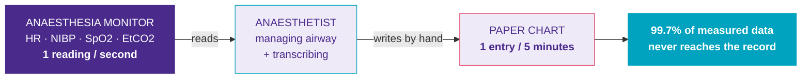
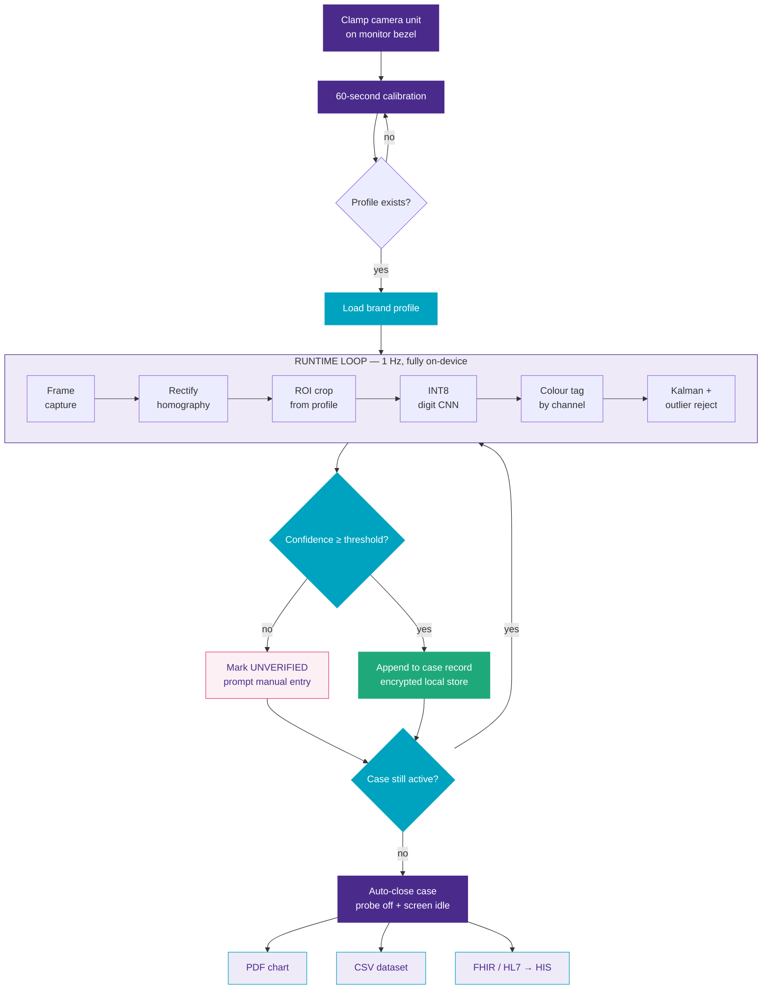
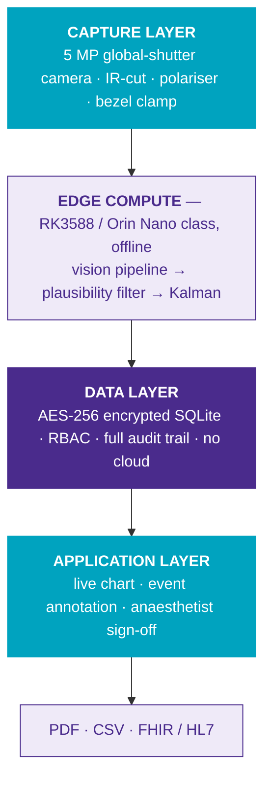

<div align="center">

# Anaesthesia Vitals Digitizer

**Turn any anaesthesia monitor into a complete digital record — with a camera.**

No cable into the monitor · No vendor SDK · No workflow change


</div>

---

## The problem



Documentation competes with clinical care — and during induction, intubation or hypotension it is the documentation that is deferred, precisely when the record matters most. Commercial digitisation needs proprietary monitor interfaces and costs **Rs. 3–10 lakh per theatre**, which no hospital running a mixed monitor fleet will approve.

This project reads what the monitor **already displays**.

> **The device is a documentation aid.** It does not diagnose, does not raise alarms, and does not influence therapy. The monitor remains the sole source of truth for clinical alerts, and the anaesthetist signs every chart before it becomes the record.

---

## How it works



### Two decisions carry all the weight

| | |
|---|---|
| **Profile-driven layout** | Each monitor model is a JSON file describing where each parameter sits on screen. Supporting a new brand is a **60-second calibration**, not a new model and not new code. |
| **Confidence gating** | A reading is rejected if it breaks the plausible range, the expected colour channel, or the rate-of-change limit. Rejected intervals are marked `unverified` and referred for manual entry. **The system never guesses a value.** |

---

## Architecture



---

## Quick start

```bash
git clone https://github.com/dhaks-cse/anaesthesiavitals_digitizer.git
cd anaesthesiavitals_digitizer

python -m venv .venv && source .venv/bin/activate    # Windows: .venv\Scripts\activate
pip install -e ".[dev]"

export AVD_DB_KEY="your-key-here"
```

| Task | Command |
|---|---|
| **Calibrate** a monitor | `avd calibrate --source 0 --out profiles/my_monitor.json` |
| **Run** the pipeline | `avd run --source 0 --profile profiles/my_monitor.json` |
| **Annotate** an event | `avd event add --case 12 --category drug --label "Propofol 120 mg"` |
| **Export** a chart | `avd export --case 12 --format pdf --out charts/case_012.pdf` |
| **Replay** vs ground truth | `avd replay --video bench_01.mp4 --profile p.json --truth truth.csv` |

Every command accepts a webcam index, a video file or an image directory as `--source`, so the whole system runs on a laptop with no hardware.

---

## Project layout

```
src/avd/
├── capture/      frame sources: webcam · video file · image directory
├── calibrate/    interactive ROI selection → brand profile
├── vision/       rectify · roi_extract · digit_recognize · colour_tag
├── filter/       plausibility checks · Kalman smoothing
├── store/        SQLAlchemy models · encrypted local database
└── cli.py        Typer entrypoints
profiles/         per-monitor JSON layout profiles
tests/            unit tests + synthetic monitor generator
```

---

## Monitor profile format

```json
{
  "name": "example_anaesthesia_monitor",
  "canonical_width": 1280,
  "canonical_height": 720,
  "parameters": [
    {
      "name": "HR",
      "unit": "bpm",
      "roi": [920, 120, 220, 120],
      "expected_colour": "green",
      "min": 30,
      "max": 180,
      "digits": 3,
      "max_delta_per_sec": 20
    }
  ]
}
```

A new hospital, a new monitor brand, a new theatre — all of it is one more file in `profiles/`.

---

## Roadmap

| Window | Phase | Scope |
|---|---|---|
| 0–3 months | **Phase 1** ✅ | Capture, calibration, recognition skeleton, storage |
| 3–9 months | **Phase 2** 🚧 | Case lifecycle, events, PDF, FHIR, trained model |
| 9–15 months | **Phase 3** | Clinical shadow-mode trial, 2 partner hospitals |
| 15–24 months | **Phase 4** | IEC 62304, ISO 13485, CDSCO Class A filing |

---

## Validation targets

| Metric | Target |
|---|---|
| Numeric read accuracy | **≥ 98%** per parameter |
| Chart completeness | **100%** of case duration |
| Monitor models supported | **4** |
| Fabricated values | **0** — flagged, never guessed |

The replay harness is the regression gate. Accuracy is measured on every commit and must not drop.

---

## Data handling

All inference runs locally on the edge device. No frames are retained, no data leaves the hospital, and there is no network dependency at runtime. The database is encrypted at rest, access is role-based, and every read, export and sign-off is written to an audit log. Key material is supplied through the environment and is never committed.

---

## Development

```bash
pytest          # runs against a synthetic monitor generator — no real footage needed
ruff check .
mypy src
```

---

## Regulatory position

Adopted from the prototype stage rather than retrofitted before filing:

`IEC 62304` software lifecycle · `ISO 13485` QMS · `CDSCO Class A` under Medical Device Rules 2017 · `HL7 v2 ORU` and `FHIR Observation` for HIS interoperability

---

<div align="center">

Developed for **MEDHA MEDITHON 2026** — organised by Leelatai Kulkarni Memorial Hospital & Research Center,
in association with BETiC (IIT Bombay), V3 Foundation (VNIT Nagpur) and BETiC–GHRCE Nagpur.

</div>
